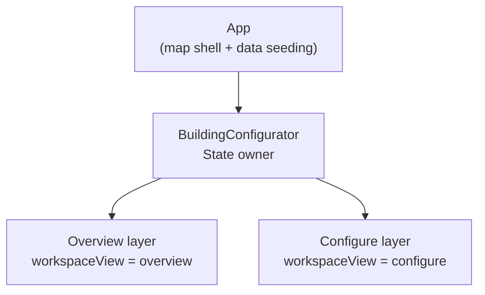
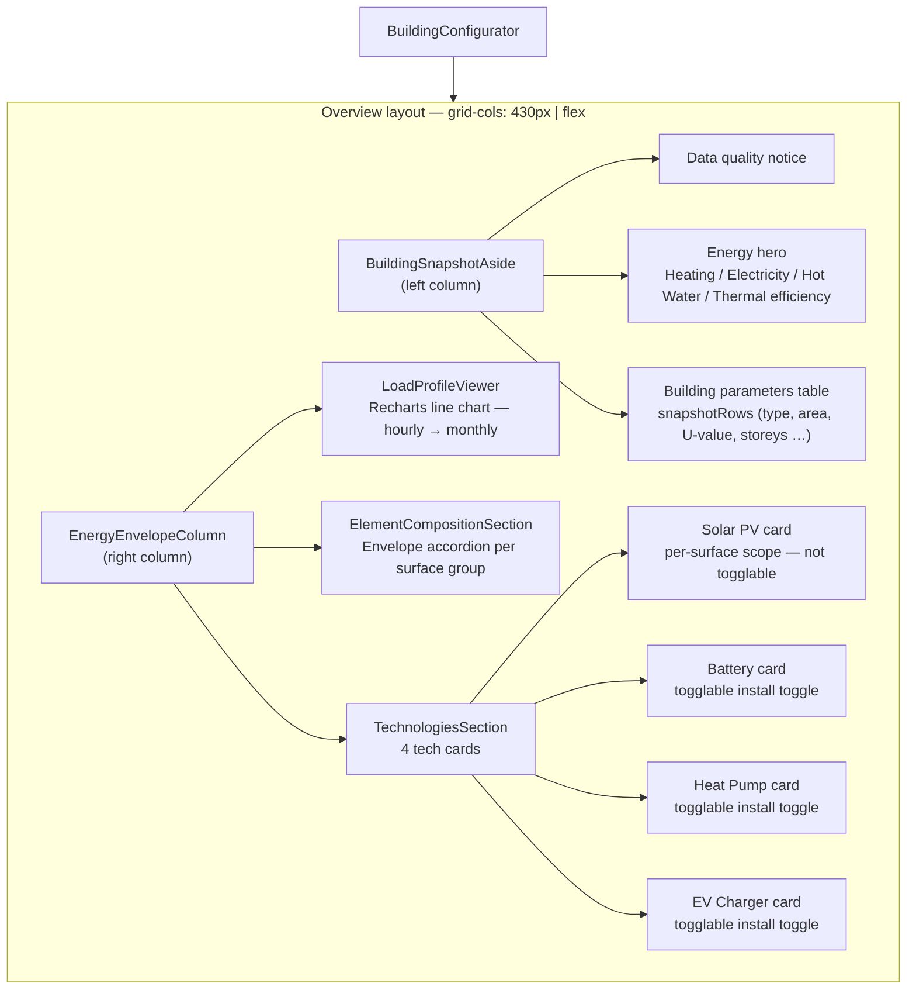
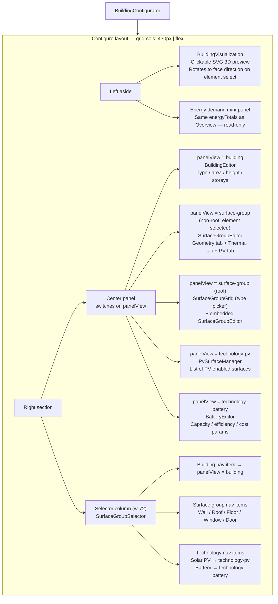
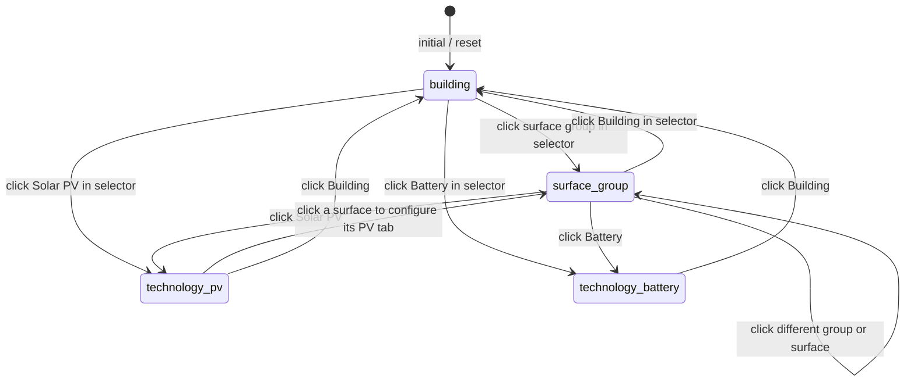
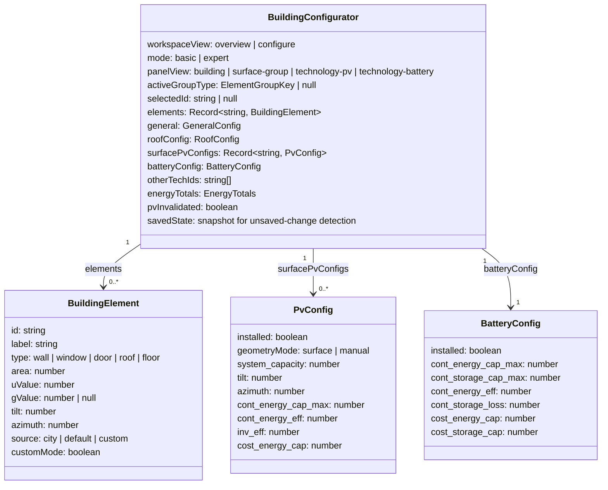
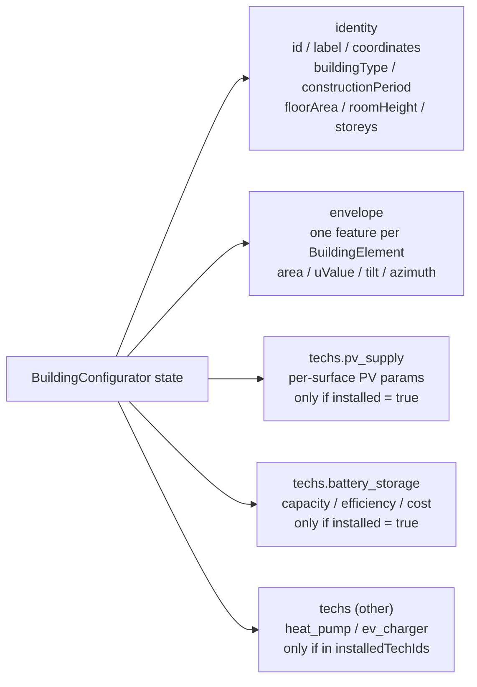
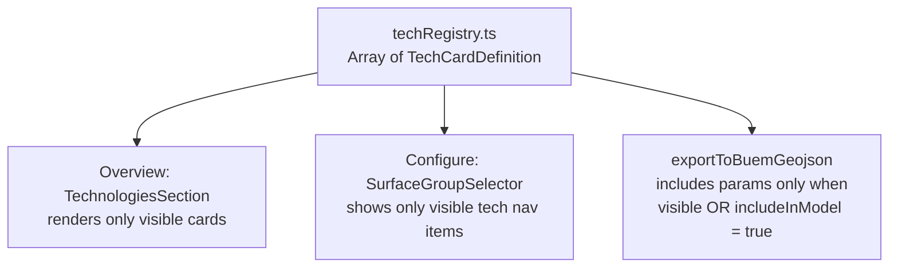

# Architecture

The Building Configurator is a single-page React application. All application state lives in one component (`BuildingConfigurator`), which renders one of two workspace layers depending on the user's current view.

## Two-layer structure



The header toggle (`Overview ↔ Configure`) switches `workspaceView` in `BuildingConfigurator`. Both layers read from the same state; neither owns its own copy.

---

## Overview layer

Displayed when `workspaceView === 'overview'`. Split into two fixed columns.



### Data flowing into Overview

| Prop | Source | Destination |
|---|---|---|
| `energyTotals` | `computeEnergyTotals(timeseries, thermalSummary)` | Energy hero numbers |
| `snapshotRows` | `buildSnapshotRows(general, elements)` | Parameters table |
| `thermalRating` | `getThermalRating(avgUValue)` | Thermal efficiency badge |
| `installedTechIds` | `otherTechIds + batteryConfig.installed` | Technology cards |
| `pvSummary` | derived from `surfacePvConfigs` | Solar PV card |
| `initialTimeseries` | `buildingData.thematic.timeseries` | Load profile chart |
| `elements` | surface state | Envelope composition |

---

## Configure layer

Displayed when `workspaceView === 'configure'`. Also split into two columns; the right column is further divided.



### Panel navigation state machine

`panelView` is driven by user interaction. The transitions are:



---

## State owned by BuildingConfigurator



---

## Data model output (`exportToBuemGeojson`)

The export assembles state into a BUEM GeoJSON FeatureCollection. Which fields appear depends on which technologies are installed.



---

## Redesign: tech card visibility registry

### Problem

Technologies (Solar PV, Battery, Heat Pump, EV Charger) are hardcoded in `TechnologiesSection.tsx` and `SurfaceGroupSelector.tsx`. Adding or hiding a technology requires editing multiple files and manually pruning the data model.

### Proposed design

Replace the hardcoded lists with a **tech registry** — a single configuration file that is the only place a developer touches when adding, removing, or hiding a technology.



#### `TechCardDefinition` type

```typescript
interface TechCardDefinition {
  /** Stable identifier used in installedTechIds and GeoJSON output. */
  id: string;

  /** Display name shown on the card. */
  label: string;

  /** Lucide icon component. */
  Icon: React.ElementType;

  /**
   * When false, the card is hidden from Overview and Configure nav.
   * The technology is effectively disabled for users.
   * Default: true.
   */
  visible: boolean;

  /**
   * When true, the tech's parameters are written to the exported data model
   * even if visible = false. Useful for pre-populating params that the
   * simulation engine always expects, regardless of whether the user sees the card.
   * Default: false.
   */
  includeInModel: boolean;

  /**
   * Where the technology is configured.
   * 'per-surface' → PV-style (no install toggle; scope is each surface).
   * 'building'    → building-level toggle + optional detail editor panel.
   * 'none'        → toggle only, no configure panel.
   */
  scope: 'per-surface' | 'building' | 'none';

  /**
   * panelView key to navigate to when the card is opened.
   * Required when scope = 'building'.
   */
  panelView?: string;
}
```

#### Example registry (`src/app/config/techRegistry.ts`)

```typescript
export const TECH_REGISTRY: TechCardDefinition[] = [
  {
    id:             'solar_pv',
    label:          'Solar PV',
    Icon:           Sun,
    visible:        true,
    includeInModel: false,
    scope:          'per-surface',
  },
  {
    id:             'battery',
    label:          'Battery',
    Icon:           Battery,
    visible:        true,
    includeInModel: false,
    scope:          'building',
    panelView:      'technology-battery',
  },
  {
    id:             'heat_pump',
    label:          'Heat Pump',
    Icon:           Thermometer,
    visible:        true,
    includeInModel: false,
    scope:          'none',
  },
  {
    id:             'ev_charger',
    label:          'EV Charger',
    Icon:           Plug,
    visible:        false,       // hidden — card does not appear in UI
    includeInModel: false,
    scope:          'none',
  },
];
```

To hide a card: set `visible: false`.
To keep its parameters in the exported JSON even when hidden: also set `includeInModel: true`.
To add a new technology: append one entry and implement the configure panel if `scope = 'building'`.

!!! info "Implementation scope"
    The registry change requires updating three files: `TechnologiesSection.tsx` (reads `TECH_REGISTRY` instead of the hardcoded `BUILDING_TECHNOLOGIES` array), `SurfaceGroupSelector.tsx` (reads `TECH_REGISTRY` for nav items), and `exportToBuemGeojson` in `buemAdapter.ts` (checks `visible || includeInModel` before writing tech params).
