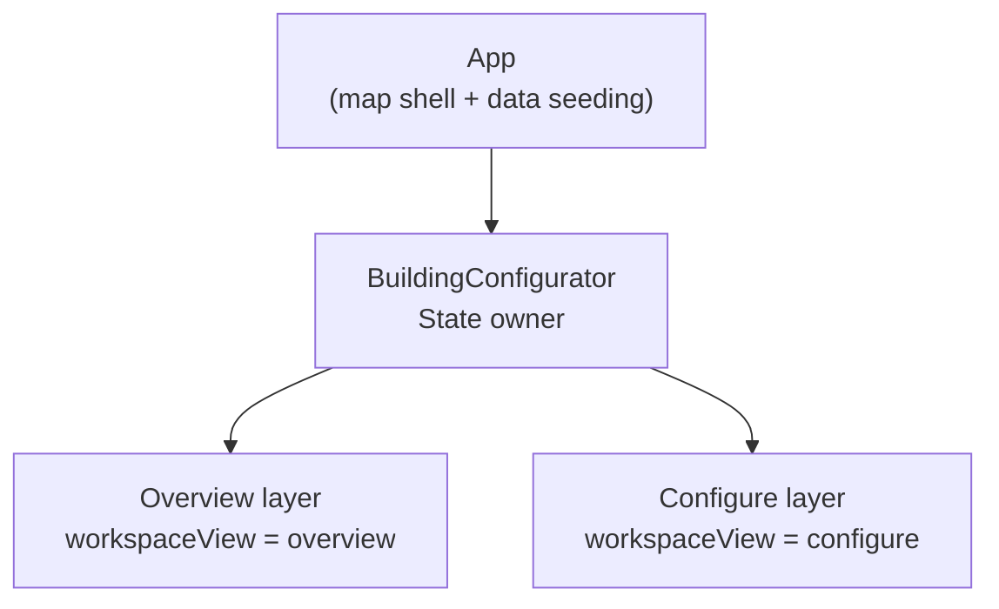
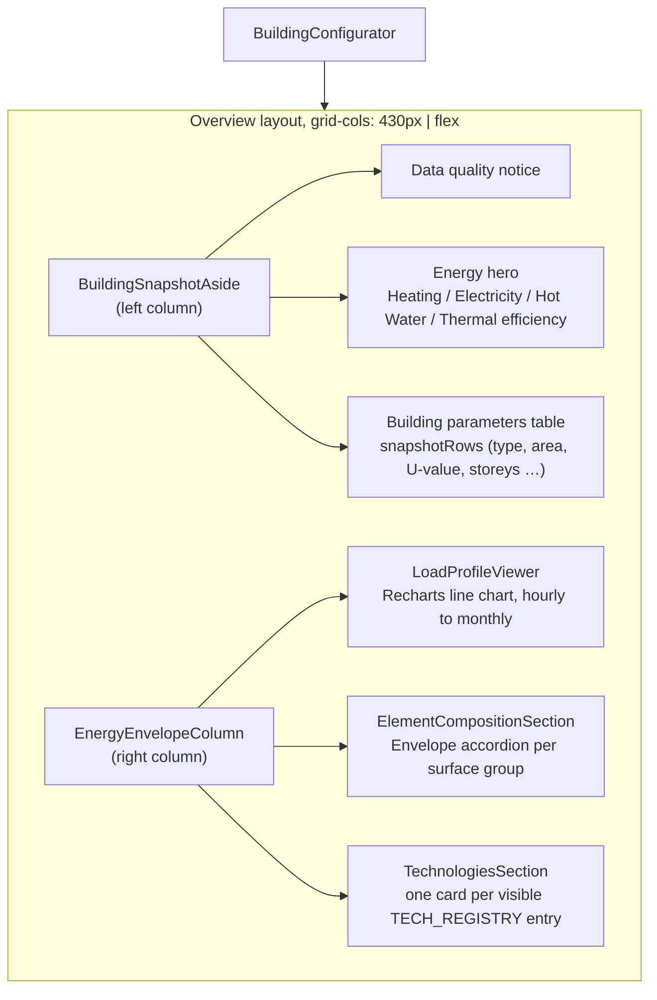
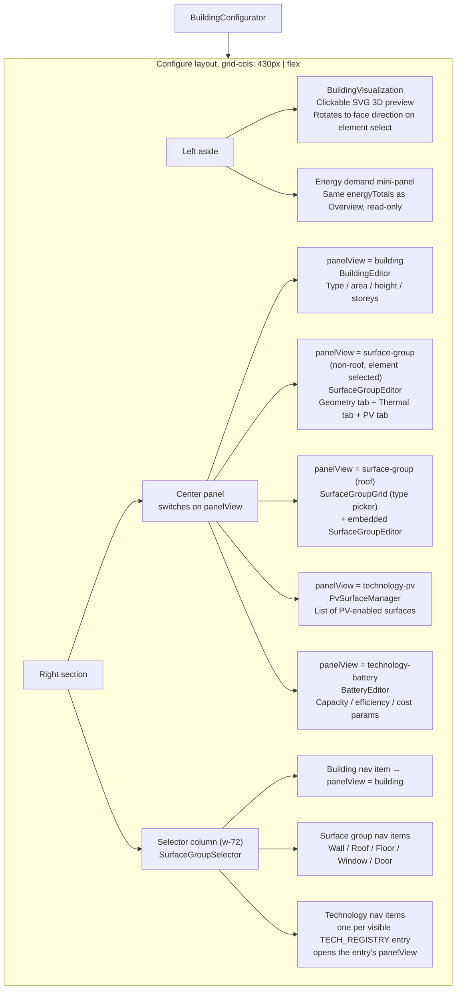
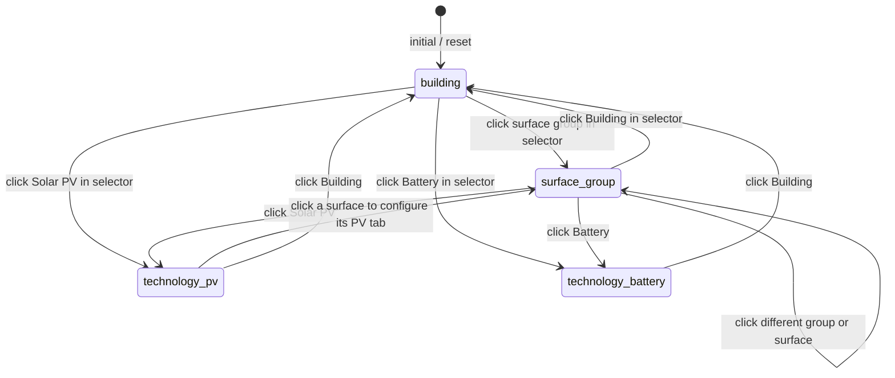
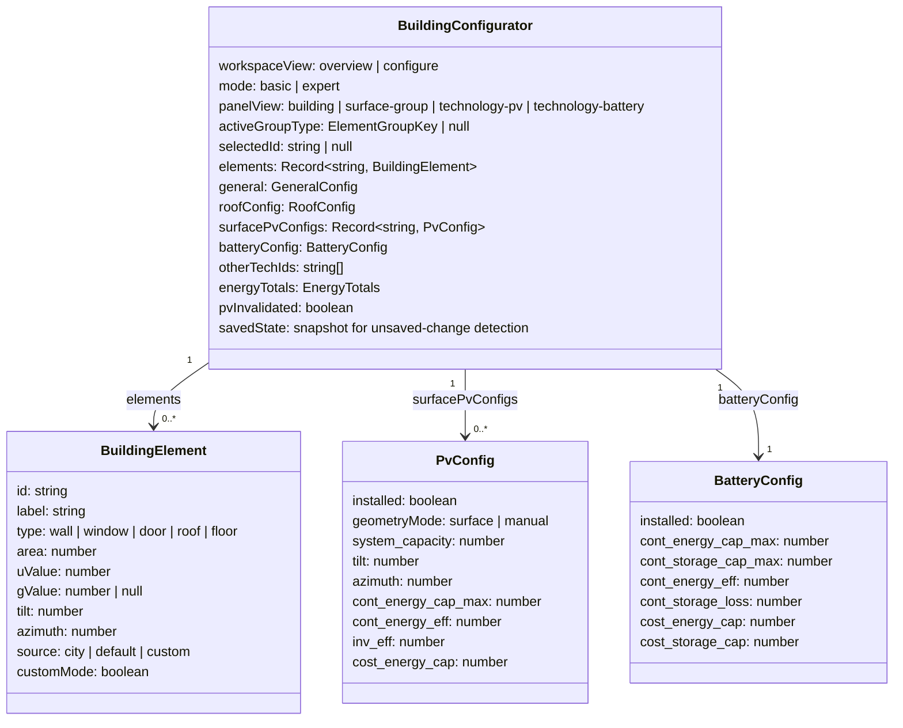
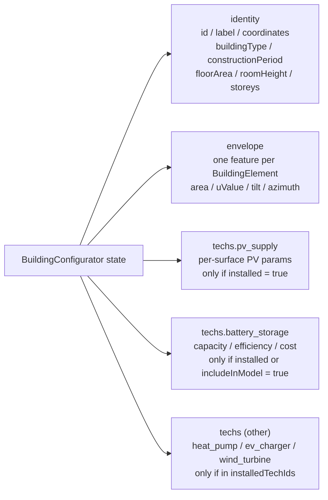

# Architecture

The Building Configurator is a single-page React application. All application state lives in one component (`BuildingConfigurator`), which renders one of two workspace layers depending on the user's current view.

## Two-layer structure

The diagram shows how the app shell hands state to the two layers.

```mermaid
graph TD
    App["App<br>(map shell + data seeding)"]
    BC["BuildingConfigurator<br>State owner"]
    OV["Overview layer<br>workspaceView = overview"]
    CF["Configure layer<br>workspaceView = configure"]

    App --> BC
    BC --> OV
    BC --> CF
```

The header toggle (`Overview ↔ Configure`) switches `workspaceView` in `BuildingConfigurator`. Both layers read from the same state; neither owns its own copy.

---

## Overview layer

Displayed when `workspaceView === 'overview'`. The diagram shows its two fixed columns and the components in each.

```mermaid
graph TD
    BC["BuildingConfigurator"]

    subgraph OV["Overview layout, grid-cols: 430px | flex"]
        BSA["BuildingSnapshotAside<br>(left column)"]
        EEC["EnergyEnvelopeColumn<br>(right column)"]

        BSA --> N1["Data quality notice"]
        BSA --> N2["Energy hero<br>Heating / Electricity / Hot Water / Thermal efficiency"]
        BSA --> N3["Building parameters table<br>snapshotRows (type, area, U-value, storeys …)"]

        EEC --> LPV["LoadProfileViewer<br>Recharts line chart, hourly to monthly"]
        EEC --> ECS["ElementCompositionSection<br>Envelope accordion per surface group"]
        EEC --> TS["TechnologiesSection<br>one card per visible TECH_REGISTRY entry"]
    end

    BC --> OV
```

### Data flowing into Overview

| Prop | Source | Destination |
|---|---|---|
| `energyTotals` | `computeEnergyTotals(timeseries, thermalSummary)` | Energy hero numbers |
| `snapshotRows` | `buildSnapshotRows(general, elements)` | Parameters table |
| `thermalRating` | `getThermalRating(avgUValue)` | Thermal efficiency badge |
| `installedTechIds` | `otherTechIds + batteryConfig.installed` | Technology cards |
| `pvSummary` | derived from `surfacePvConfigs` | Solar PV card |
| `initialTimeseries` | `buildingData.thematic.timeseries` | Load profile chart |
| `elements` | surface state | Envelope composition |

---

## Configure layer

Displayed when `workspaceView === 'configure'`. The diagram shows its two columns, the right one divided into a centre panel and a selector column.

```mermaid
graph TD
    BC["BuildingConfigurator"]

    subgraph CF["Configure layout, grid-cols: 430px | flex"]
        LA["Left aside"]
        RS["Right section"]

        LA --> BV["BuildingVisualization<br>Clickable SVG 3D preview<br>Rotates to face direction on element select"]
        LA --> ED["Energy demand mini-panel<br>Same energyTotals as Overview, read-only"]

        RS --> CP["Center panel<br>switches on panelView"]
        RS --> SC["Selector column (w-72)<br>SurfaceGroupSelector"]

        CP --> PB["panelView = building<br>BuildingEditor<br>Type / area / height / storeys"]
        CP --> PSG["panelView = surface-group<br>(non-roof, element selected)<br>SurfaceGroupEditor<br>Geometry tab + Thermal tab + PV tab"]
        CP --> PRG["panelView = surface-group (roof)<br>SurfaceGroupGrid (type picker)<br>+ embedded SurfaceGroupEditor"]
        CP --> PPV["panelView = technology-pv<br>PvSurfaceManager<br>List of PV-enabled surfaces"]
        CP --> PBT["panelView = technology-battery<br>BatteryEditor<br>Capacity / efficiency / cost params"]

        SC --> SNav["Building nav item → panelView = building"]
        SC --> SGNav["Surface group nav items<br>Wall / Roof / Floor / Window / Door"]
        SC --> STNav["Technology nav items<br>one per visible TECH_REGISTRY entry<br>opens the entry's panelView"]
    end

    BC --> CF
```

### Panel navigation state machine

`panelView` is driven by user interaction. The transitions are:

```mermaid
stateDiagram-v2
    [*] --> building : initial / reset

    building --> surface_group : click surface group in selector
    building --> technology_pv : click Solar PV in selector
    building --> technology_battery : click Battery in selector

    surface_group --> building : click Building in selector
    surface_group --> surface_group : click different group or surface
    surface_group --> technology_pv : click Solar PV
    surface_group --> technology_battery : click Battery

    technology_pv --> surface_group : click a surface to configure its PV tab
    technology_pv --> building : click Building
    technology_battery --> building : click Building
```

---

## State owned by BuildingConfigurator

The diagram shows the state fields held in `BuildingConfigurator` and the types they reference.

```mermaid
classDiagram
    class BuildingConfigurator {
        workspaceView: overview | configure
        mode: basic | expert
        panelView: building | surface-group | technology-pv | technology-battery
        activeGroupType: ElementGroupKey | null
        selectedId: string | null
        elements: Record~string, BuildingElement~
        general: GeneralConfig
        roofConfig: RoofConfig
        surfacePvConfigs: Record~string, PvConfig~
        batteryConfig: BatteryConfig
        otherTechIds: string[]
        energyTotals: EnergyTotals
        pvInvalidated: boolean
        savedState: snapshot for unsaved-change detection
    }

    class BuildingElement {
        id: string
        label: string
        type: wall | window | door | roof | floor
        area: number
        uValue: number
        gValue: number | null
        tilt: number
        azimuth: number
        source: city | default | custom
        customMode: boolean
    }

    class PvConfig {
        installed: boolean
        geometryMode: surface | manual
        system_capacity: number
        tilt: number
        azimuth: number
        cont_energy_cap_max: number
        cont_energy_eff: number
        inv_eff: number
        cost_energy_cap: number
    }

    class BatteryConfig {
        installed: boolean
        cont_energy_cap_max: number
        cont_storage_cap_max: number
        cont_energy_eff: number
        cont_storage_loss: number
        cost_energy_cap: number
        cost_storage_cap: number
    }

    BuildingConfigurator "1" --> "0..*" BuildingElement : elements
    BuildingConfigurator "1" --> "0..*" PvConfig : surfacePvConfigs
    BuildingConfigurator "1" --> "1" BatteryConfig : batteryConfig
```

---

## Data model output (`exportToBuemGeojson`)

The export assembles state into a BUEM GeoJSON FeatureCollection. Which fields appear depends on which technologies are installed.

```mermaid
graph LR
    S["BuildingConfigurator state"]

    S --> ID["identity<br>id / label / coordinates<br>buildingType / constructionPeriod<br>floorArea / roomHeight / storeys"]
    S --> ENV["envelope<br>one feature per BuildingElement<br>area / uValue / tilt / azimuth"]
    S --> PV["techs.pv_supply<br>per-surface PV params<br>only if installed = true"]
    S --> BAT["techs.battery_storage<br>capacity / efficiency / cost<br>only if installed or includeInModel = true"]
    S --> OTH["techs (other)<br>heat_pump / ev_charger / wind_turbine<br>only if in installedTechIds"]
```

---

## Technology registry

`src/app/config/techRegistry.ts` defines every technology in `TECH_REGISTRY`. `TechnologiesSection` (Overview cards), `SurfaceGroupSelector` (Configure nav) and `exportToBuemGeojson` in `buemAdapter.ts` all read it, so adding, hiding or removing a technology starts in that file.

| Field | Effect |
|---|---|
| `visible` | `false` hides the card in Overview and the nav item in Configure. |
| `includeInModel` | `true` writes the technology's parameters to the export even when `visible` is `false`. |
| `scope` | `per-surface`: configured on each surface, no install toggle. `building`: install toggle and a configure panel. `none`: install toggle only. |
| `panelView` | The panel opened for the technology. Required when `scope` is `building` or `per-surface`. |

To add a building-level technology, append an entry, implement its panel component, and add a matching case in `renderCenterPanel` in `BuildingConfigurator.tsx`.
