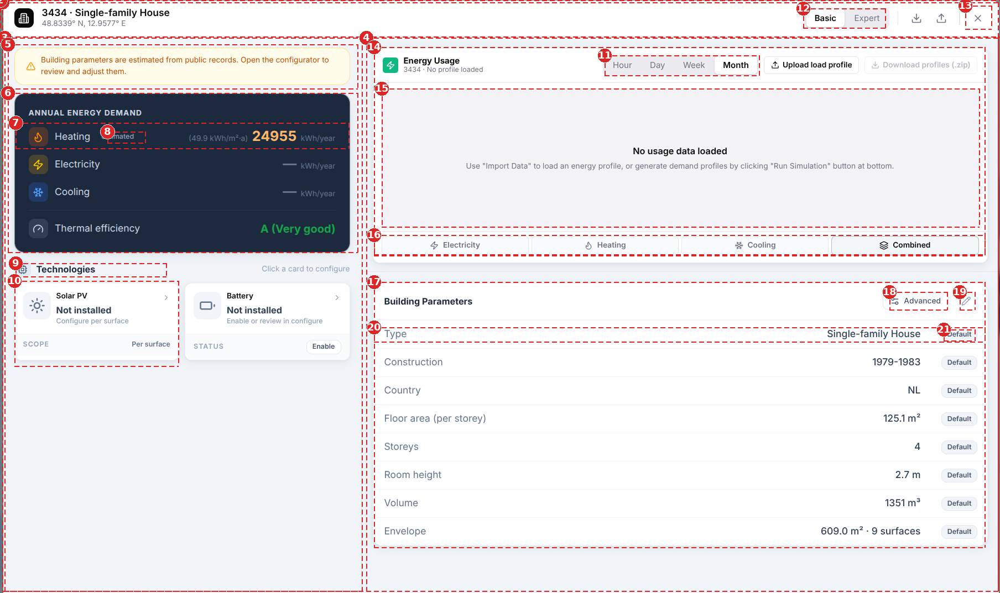

# UI Terminology

A glossary for the region names used in the Overview layer (`workspaceView = 'overview'`). Numbers on the screenshot are keyed to the table below it, so each name points at the region it describes. Use these names in pull requests and issue reports.

## Annotated screenshot

Region **1**, the panel, is the outermost dashed box at the edge of the image.

## Glossary

| # | Term | Definition | Use it when | Implemented in |
| --- | --- | --- | --- | --- |
| 1 | Panel | Self-contained surface with its own header, hosting a whole workflow | Grouping a header and multiple columns as one persistent visual unit | `BuildingConfigurator.tsx` root `.cfg-panel` div |
| 2 | Header | Fixed top strip: identity, mode switch, toolbar actions | The panel needs a persistent identity + global actions row above the content | `BuildingConfigurator.tsx` |
| 3 | Aside (left column) | A column carrying glance-only summary/status, secondary to the main working area | The column's job is "at-a-glance", not the primary task | `BuildingSnapshotAside.tsx` |
| 4 | Column (right column) | Vertical layout region inside a panel, independently scrollable | Splitting a workspace into regions that scroll or resize independently | `EnergyEnvelopeColumn.tsx` |
| 5 | Alert / banner / notice | Full-width coloured strip with icon, unmissable | Surfacing a warning/info the user must see before acting | `BuildingSnapshotAside.tsx` |
| 6 | Card | Bounded surface with its own border + shadow, holds one topic | Content is a distinct topic that should read as liftable/standalone | Energy hero card |
| 7 | Row / stat row | One icon + label + value line inside a card | Repeating a label-value pair | `BuildingSnapshotAside.tsx` |
| 8 | Badge / pill / tag | Small rounded label attached to a value, states its status or provenance | Annotating a value without a separate column or row | `SourceTag` ("estimated") |
| 9 | Section | Grouped content under a heading, no extra card chrome of its own | You need a heading over content that's already boxed, avoiding card-in-card nesting | "Technologies" heading |
| 10 | Card (tile variant) | A selectable card: clickable, with its own status row | Same as #6, plus the card itself is the click target | Solar PV / Battery tech cards |
| 11, 12 | Segmented control | Filled pill, multi-option, mutually exclusive, switches instantly | Switching a display mode or resolution, not navigating to different content | `SegmentedControl` (`shared/ui.tsx`), used for both #11 (chart resolution) and #12 (Basic/Expert) |
| 13 | Icon button | Small square button, icon only, tooltip carries the label | A toolbar action with limited space and an unambiguous icon | `HeaderBtn` |
| 14 | Card (widget variant) | A card whose body is a data visualisation rather than a table | Same as #6, content is a chart/graph instead of rows | `LoadProfileViewer.tsx` |
| 15 | Empty state | Placeholder inside a card's content area when there's no data yet | The content area normally holds data but currently has none | "No usage data loaded" |
| 16 | Toggle button group / pill strip | Full-width row of equal buttons, one active, filters a sibling area | Filtering the content of a sibling area (the chart), not switching the whole view | Electricity/Heating/Cooling/Combined strip |
| 17 | Card | Same as #6 | See #6 | `BuildingDetailsCard.tsx` |
| 18 | Labelled icon button | Icon button with a visible text label, not tooltip-only | The action is used often enough to deserve a permanent label, not just an icon | "Advanced" button |
| 19 | Icon button | Same as #13 | See #13 | Edit (pencil) toggle |
| 20 | Row | Same as #7, but as a table `<tr>` (label / value / status) instead of a flex row | The repeating unit is naturally tabular (fixed columns) | Property table row |
| 21 | Badge | Same as #8 | See #8 | `SnapshotStatusBadge` ("Default") |

!!! note "Not visible in this screenshot"
    - **Modal / Dialog** (`ElementConfiguratorModal`, built on `@radix-ui/react-dialog`) and **menu-bar tabs** (the Parameters/Envelope underline tabs on card #17) appear only after the user opens an editor or switches to Expert mode. The screenshot is Basic mode with no editor open.
    - **Overlay / backdrop**, the dimmed and blurred page behind the panel, is cropped out.

## Choosing a control

- **Segmented control** for a real mode switch (Basic/Expert, chart resolution).
- **Menu-bar tabs** (plain underline buttons) when two labels swap the entire body of one card (Parameters ↔ Envelope). See the comment in `BuildingDetailsCard.tsx`.
- **Card** when content should stand as its own visual block (own border and shadow). **Section** when content is already boxed and only needs a heading, which avoids a card inside a card (see `BuildingSnapshotAside.tsx`).
- **Modal** (`ElementConfiguratorModal`) only for exclusive single-topic editing. **Panel** (`BuildingConfigurator` root) for the always-visible dashboard everything else sits inside.
